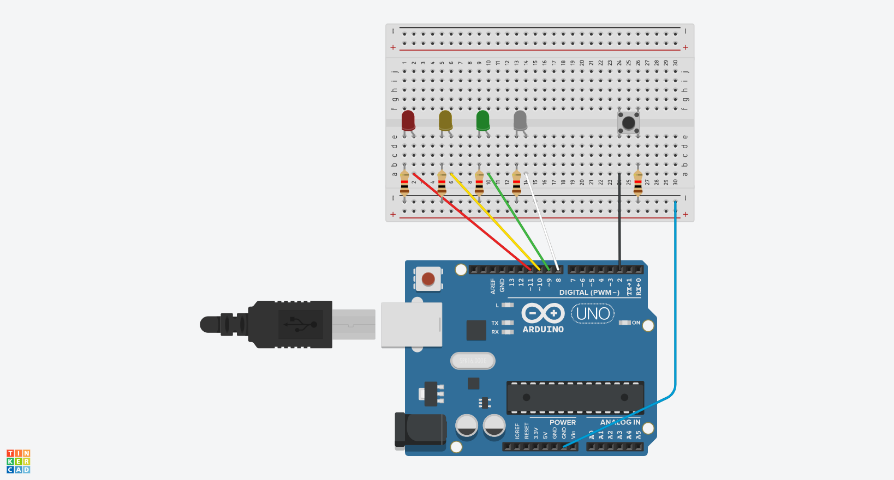

# Traffic Light Simulation
This project is the final project for CDA 3104 and is a simulation of a traffic light. The Red LED anode corresponds with PORTB PIN3, Yellow LED with PORTB PIN2, Green LED with PORTB PIN 1, and White LED with PORTB PIN0. PORTD PIN2 is set to pull-up, with the button triggering state change.  

When the Arduino is powered on, the Red LED turns on. After that it will cycle between Green LED, Yellow LED, Red LED, then Green again, infinitely. I used a 3-second timer, Timer1 CTC mode interrupt A, that cycles through the Z pointer array that is populated with bitmasks for Green, Yellow, Red, Crosswalk (red and white) LEDs. By default, the light cycle stops at red, resets then Z pointer, and starts all over again. When the button is pressed, external interrupt request 0 is triggered, changing the stack pointer endpoint to include the crosswalk. After the crosswalk light is turned on, the stack pointer endpoint resets to not include the crosswalk. It then continues to infinitely loop.

## Demonstration

## Diagrams

## Built With
- Atmel Studio 7.0
- [ELEGOO UNO R3 Board ATmega328P](https://www.amazon.com/gp/product/B01D8KOZF4/ref=ppx_yo_dt_b_asin_title_o01_s01?ie=UTF8&psc=1)
- Assembly 

## Author
Ryan Smith

## Acknowledgments
Professor Paul Allen provided libraries and great tutorials.

## Key Programming Concepts Utilized
- Global Interrupts
- Pointer Arrays
- Timers
